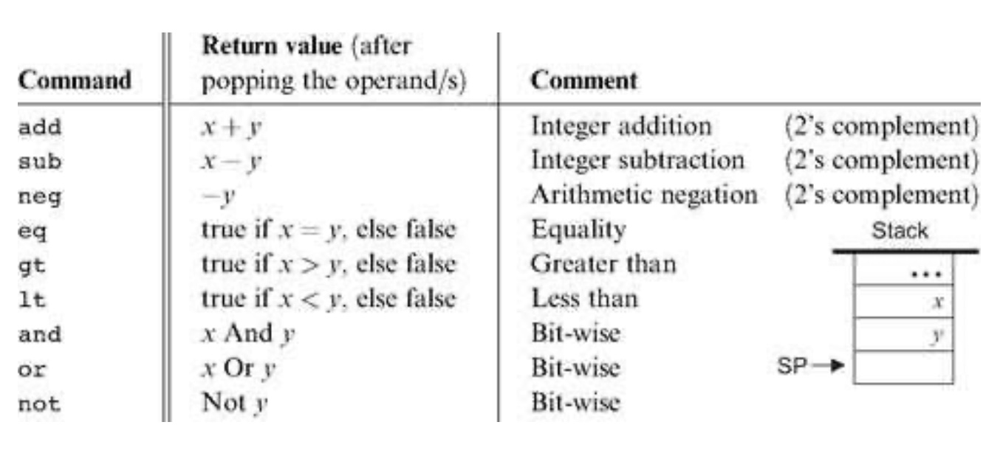
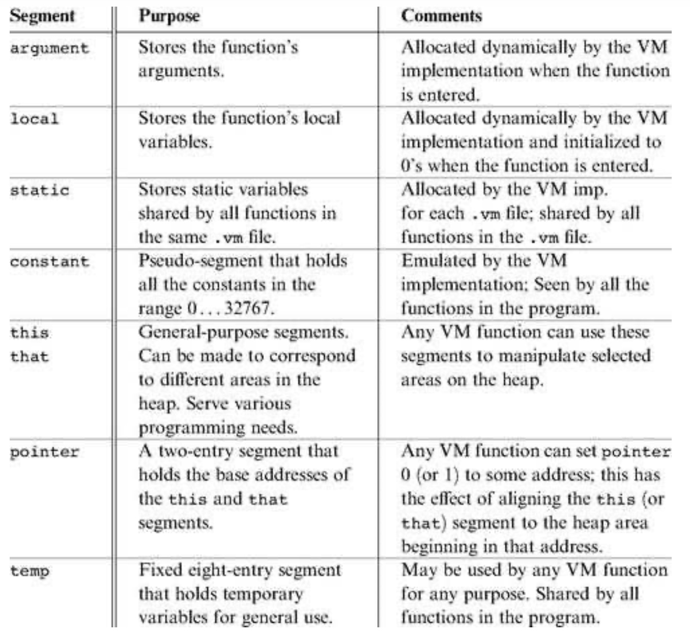

# VMTranslator

VMTranslator translates the Virtual Machine code into the [Hack Assembly language](https://github.com/EZabolotniy/hack-assembler). VM is described in the first two weeks of the course – https://www.coursera.org/learn/nand2tetris2

The virtual machine is stack-based: all operations are done on a stack. It is also function-based: a complete VM program is organized in program units called functions, written in the VM language. Each function has its own stand-alone code and is separately handled. The VM language has a single 16-bit data type that can be used as an integer, a Boolean, or a pointer. The language consists of four types of commands:

* Arithmetic commands perform arithmetic and logical operations on the stack.



* Memory access commands transfer data between the stack and virtual memory segments:
  - `push segment index` Push the value of segment[index] onto the stack.
  - `pop segment index` Pop the top stack value and store it in segment[index].
  


* Program flow commands facilitate conditional and unconditional branching operations.
```
  - label <symbol>    // Label declaration
  - goto <symbol>     // Unconditional branching
  - if-goto <symbol>  // Conditional branching
```
 
* Function calling commands call functions and return from them.
```
  - function <functionName> <nLocals> // Function declaration, specifying the
                                      // number of the function's local
  - call <functionName> <nArgs>       // Function invocation, specifying the
                                      // number of the function's arguments
  - return                            // Transfer control back to the calling function
```
